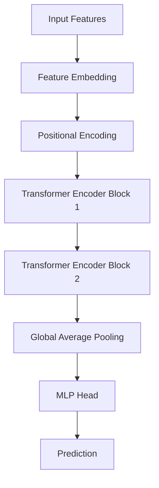

# Transformer Architecture for Numerai

## Overview
This model projects scalar features into tokens, processes them via Transformer Encoder blocks, and outputs a prediction through an MLP head.

## Diagram

